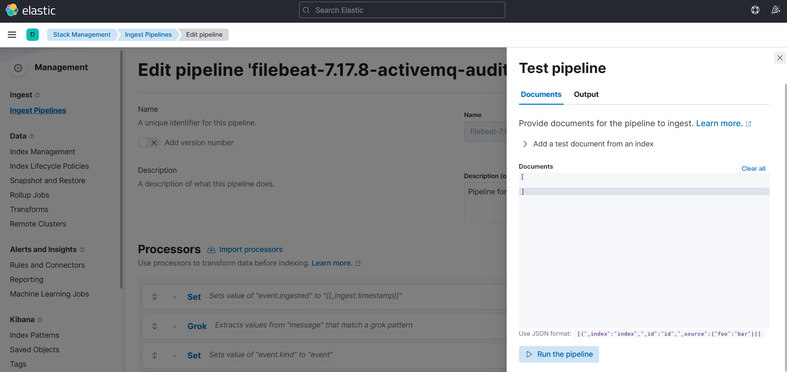
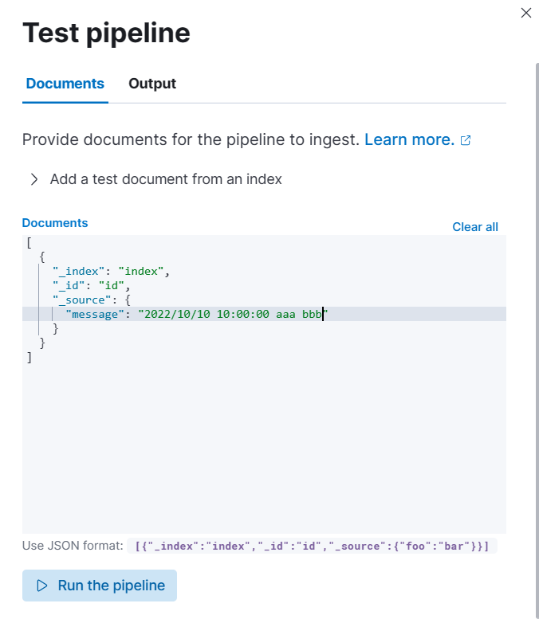
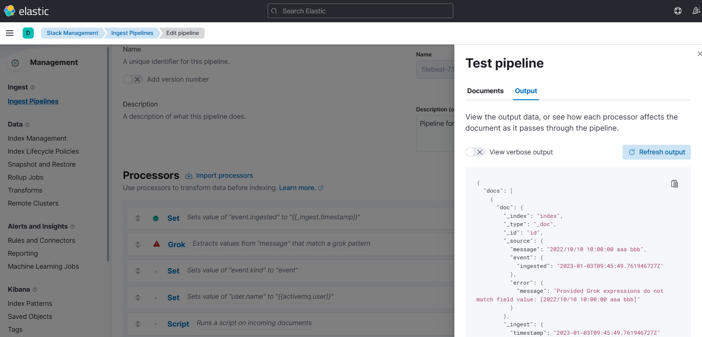

# Filebeatの使いかた(3章)  

[1章](https://github.com/RyuTanak/How-To-Filebeat-1)では、データ取得、データ送信についてやりました。  
[2章](https://github.com/RyuTanak/How-To-Filebeat-2)では、データ加工の方法について説明しました。  
3章では、もう少し複雑なログの分解をやってみたいと思います。  

## 目次  
[入力条件](#content1)  
[moduleの作成](#content2)  
[filebeat.yml](#content3)  
[webserver.yml](#content4)  
[log.yml、manifest.yml](#content5)  
[pipeline.yml](#content6)  

<h2 id="content1">入力条件</h2>  

例えばWebサーバのログであれば、出力されるログは
Request、Responseだったり、サーバ自体にログインしたりと様々なログが出現する。  
このように1つの機器から複数種類のログが出力されることがあり、その場合でもFilebeatは対応することが可能である。  

対応方法は様々あるが、1つとして以下の方法を紹介する。  

入力となるログは以下とする
```  
2023-01-01 10:00:00 hp00001aa[12334] Response: 199.20.11.44 ms0000000 501 success 10ms  
2023-01-01 11:00:00 hp00001aa[543] Response: 199.20.11.44 ms0000001 404 fail 100ms error connect  
2023-01-01 12:00:00 hp00001aa[7890] login: 199.20.11.43 rtanaka OK
2023-01-02 10:00:00 hp00001ab[111111] Request: 199.20.12.43 ms0000001 503 success 12 https://github.com
2023-01-02 11:00:00 hp00001ab[232] Request: 199.20.12.21 ms0000003 501 success 90ms https://github.com/Ryu.tanak
2023-01-02 12:00:00 hp00001ab[3543] login: 199.20.12.11 rtanaka NG Password faiid
2023-01-03 10:00:00 hp00001ac[23123] Response: 199.20.13.34 ms0000002 501 success 80ms
2023-01-03 11:00:00 hp00001ac[647676] Request: 199.20.13.44 ms0000004 501 success 70ms https://github.com
2023-01-03 12:00:00 hp00001ac[454777] Response: 199.20.13.54 ms0000005 503 success 60ms  
```

登録先のindexを以下のように定義する。  
index名：webServer_index  
log_typeが「Response」  
|@timestamp|host_name|process_id|log_type|dstip|module_name|status_code|status|access_time|message|  
|-|-|-|-|-|-|-|-|-|-|  
|2023-01-01 10:00:00|hp00001aa|12334|Response|199.20.11.44|ms0000000|501|success|10|-|
|2023-01-01 11:00:00|hp00001aa|543|Response|199.20.11.44|ms0000001|404|fail|100|error connect|
|2023-01-03 10:00:00|hp00001ac|23123|Response|199.20.13.34|ms0000002|501|success|80|-|
|2023-01-03 12:00:00|hp00001ac|454777|Response|199.20.13.54|ms0000005|503|success|60|-|  

※statusがsuccessの場合、messageは空  

log_typeが「Request」  
|@timestamp|host_name|process_id|log_type|srcip|module_name|status_code|status|access_time|message|  
|-|-|-|-|-|-|-|-|-|-|  
|2023-01-02 10:00:00|hp00001ab|111111|Request|199.20.12.43|ms0000001|503|success|12|https://github.com|
|2023-01-02 11:00:00|hp00001ab|232|Request|199.20.12.21|ms0000003|501|success|90|https://github.com/Ryu.tanak|
|2023-01-03 11:00:00|hp00001ac|647676|Request|199.20.13.44|ms0000004|501|success|70|https://github.com|

log_typeが「login」 
|@timestamp|host_name|process_id|log_type|srcip|login_name|result|message|
|-|-|-|-|-|-|-|-|
|2023-01-01 12:00:00|hp00001aa|7890|login|199.20.11.43|rtanaka|OK|-|
|2023-01-02 12:00:00|hp00001ab|3543|login|199.20.12.11|rtanaka|NG|Password faiid|

※resultがOKの場合、messageは空  

上記のように、1つのindexに複数種類あるWebサーバのログを登録する。  

<h2 id="content2">moduleの作成</h2>  

moduleを用意することで、1つのFilebeatで複数機器のログ取集が行えます。  
（今回はWebサーバの1機器であるが、紹介としてmoduleを作成する。）  

フォルダ構成は以下のようになります。  

├etc  
│└filebeat  
│　├filebeat.yml  
│　└modules.d  
│　　├webserver.yml　←追加  
│　　├・・・  
├usr  
│└share  
│　└filebeat  
│　　└module  
│　　　└webserver　←ここから下全部追加  
│　　　　└log  
│　　　　　├config  
│　　　　　│└log.yml  
│　　　　　├ingest  
│　　　　　│└pipeline.yml  
│　　　　　└manifest.yml  

<h2 id="content3">filebeat.yml</h2>  

filebeat.ymlを以下のように実装する。  

```yaml
filebeat.inputs:
filebeat.config.modules:
  path: ${path.config}/modules.d/*.yml
setup.template.name: "tokyo"
setup.template.pattern: "tokyo-*"
setup.ilm.enabled: false
output.elasticsearch:
  hosts: ["localhost:9200"]
  indices:
    - index: "webserver_index"
      when.equals:
        event.module: "webserver"
```

下から4行部分で、moduleごとのindexの登録先を指定しています。  
indicesのリファレンスは[こちら](https://www.elastic.co/guide/en/beats/filebeat/current/elasticsearch-output.html#indices-option-es)  

<h2 id="content4">webserver.yml</h2>  

webserver.ymlを以下のように実装する。  
```yaml
- module: webserver
  log:
    enabled: true
```

<h2 id="content5">log.yml、manifest.yml</h2>  

log.ymlを以下のように実装する。  
```yaml
paths:
{{ range $i, $path := .paths }}
  - {{$path}}
{{ end }}

exclude_files: [".gz$"]
```

manifest.ymlを以下のように実装する。
```yaml
var:
  - name: paths
    default: /var/log/test/*.log
ingest_pipeline:
  - ingest/pipeline.yml
input: config/log.yml
```

<h2 id="content6">pipeline.yml</h2>  

最終的なpipeline.ymlは以下のように実装する。
```yaml
processors:
- grok:
    field: message
    patterns: 
      - "%{TIMESTAMP:timestamp} %{GREEDYDATA:other}"
    pattern_definitions:
      TIMESTAMP: "%{YEAR}-[0-9]{2}-[0-9]{2} %{TIME}"
- dissect:
    field: other
    pattern: "%{host_name}[%{process_id}] %{log_type}: %{log_data}"

```

<h2 id="content6">pipelineの検討方法</h2>  

pipelineを作成するにあたって、作成したpipelineが正しくログを取得できているかどうか  
filebeatを起動させなくても、確認する方法がいくつかある。  
その中の1つを紹介する。  

kibanaの画面から Stack Management > Ingest Pipelines の画面を開いて  
すでに作成されているpipelineを選択し、編集画面を開く。  

「Add documents」のボタンを選択し、Test pipelineを開く。  
  

「Use JSON format」の右側にあるJSONをコピーして、上の「document」に貼り付ける。  
_sourceの中を以下のように変更する。（messageの右側は、入力したい文字列を入れる）  
  

「Run the pipeline」を押して実行すると、以下のようにどこのProcessorでエラーになるのか、エラーの内容  
などを見ることができる。  
  


